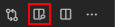

# The 0x00000000.dev Developer Blog


[](https://0x00000000.dev/)

[](https://GitHub.com/Sunglasses-At-Night/Sunglasses-At-Night.github.io/graphs/contributors/)


[](http://makeapullrequest.com)
[](https://GitHub.com/Sunglasses-At-Night/Sunglasses-At-Night.github.io/pulls/)

<p align="center">
  

This repository hosts the [0x00000000.dev](https://0x00000000.dev) developer blog.

## Quick Start

### Getting a local copy

SSH (Recommended):

```bash
git clone git@github.com:Sunglasses-At-Night/Sunglasses-At-Night.github.io.git 0x00000000
```

HTTPS:

```bash
git clone https://github.com/Sunglasses-At-Night/Sunglasses-At-Night.github.io.git 0x00000000
```

### Setting up your environment

As it is the recommended development tool, install VS Code.

Navigate to the `source` directory:

```bash
cd source 
```

Launch VS Code with the `source` directory as the root directory:

```bash
code .
```

This will allow images to be loaded in the preview window.

It is recommended that you install the following extensions:

- VS Code
  - Markdown All in One
    - Posts use Markdown so having tools is nice.
  - MarkdownLint
    - It's pedantic, but worth it to keep post consistency. You can ignore some of the warnings it generates.
  - Spell Right
    - Spellchecking is good.
  - Grammarly
    - It is recommended that you do not always have it enabled when writing a post as it can be quite slow. Great for doing a more thorough check of your work.

Open the VSCode MarkDown preview from the top right of your editor window:\


This will bring up a nice preview window for your post.

## Creating a post

### Making a new post file

To start off, make a copy of `source/_posts/_copyMe.md`. Name the copy according to your post's content.

Within the new copy, fill out the information at the top. This information will be used when generating the post.

`title`

- The title of the post

`author`

- Your name/handle

`tags`

- Add as many tags as you would like related to your post.

`date`

- The current date in `YYYY-MM-DD` format. You can leave `01:01:0` as-is.

Using MarkDown syntax and, optionally, inline HTML, write the content of your post.
Keep posts decently professional.

### Using images in your post

Post images can be saved to `_posts/images/` and referenced in posts like so:

```md

```

Please keep images in web friendly formats when possible - especially prefer WEBMs over GIFs.

### Uploading your content to the site

Once you've written or updated your post, push the content to the `main` branch. Make sure to follow good practices and write good commit messages.

```bash
git add .
git commit -m "Updated XYZ post, adding ABC content."
git pull
git push
```

Once you have pushed, a GitHub action will run and the new site will be pushed to the `generated` branch's `docs/` folder. This folder is then hosted by GitHub pages.\
Please be patient as this may take some time to propagate. You may also need to force reload the page to overwrite local page caching (`CRTL+SHIFT+R` on Chrome).

## Pull Requests

As we accept pull requests, they will be reviewed and merged in.

Any major issues will be posted to the PR's thread and they must be fixed before your PR will be merged in.

## Notes

- Do _not_ modify the `generated` branch unless you are attempting to fix an error in the auto-deploy GitHub action.
- [SPECTRE.CSS](https://picturepan2.github.io/spectre/) is included and can be used.
- Please test posts on mobile. Use relative viewports/scaling whenever possible.
- Files prefixed with "_" will be ignored.
- If the theme is updated, `hexo generate --force` must be run. The theme shouldn't be changed much to avoid old posts breaking. I (@alisenai) should be the one to do this for you, but please don't edit the styling without good reason as it will affect _all_ posts.

## Future TODOs

- Collapsible headers.
- Load-on-scroll content (for large posts with lots of content).
- [AOS](https://michalsnik.github.io/aos/)
- Fix issues with site based on google's and `web.dev`'s site tester.
- Consider a private testing site/branch for non-complete posts.
- Consider setting a second push repo on GitHub.
