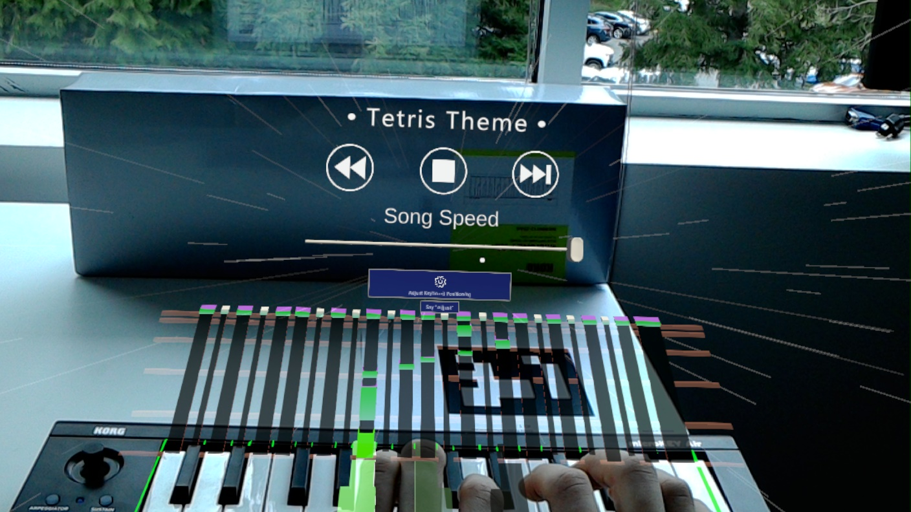

## Design Goal

When starting this project, the primary design goal was to create a gamified teaching experience where players would learn to play piano on a Bluetooth MIDI keyboard while seeing note blocks falling onto their keyboard keys in time with the song they're playing. If done right, the experience should be reminiscent of [Guitar Hero](https://en.wikipedia.org/wiki/Guitar_Hero) or [Synthesia](https://synthesiagame.com/) with the exception being that the user is seeing the notes flying towards an actual piano as opposed to a digital copy of one on a monitor.

## Objectives

In order to accomplish our design goal, we needed to achieve the following objectives:

- Find XR hardware that is either:
  1. A VR setup capable of rendering a game world with an accurate, real time, 1-1 correspondence with important elements of the real world such as hand location, finger location, and piano location
  2. An AR setup capable of rendering the MIDI notes on top of the physical world and aligning it with the physical piano
- create the 'note falling' MIDI visualization in a 3d environment on time with the music being played
- lock the 'game world' to the 'real world' geometry, therefore augmenting the boundary between the physical play-space and the artificial MIDI visualization

## [Objective 1] Finding hardware

### Attempt 1: VR

our first attempt at finding hardware to accomplish our design goals, was to investigate the use of a traditional VR headset, such as the [Valve Index](https://store.steampowered.com/valveindex), in combination with a [Leap Motion Hand Tracking](https://www.ultraleap.com/product/leap-motion-controller/) Device. While this was knowingly going to be the harder option, it would've accomplished an additional unspoken goal of proving that augmented reality can by "faked" using much cheaper VR hardware. Unfortunately we didn't reach that conclusion. As it turns out, while the Valve Index has very good tracking, The Leap Motion Controller is just not ready for tracking the precise and delicate hand movements of playing a piano. We quickly learned that the players hands would be rendered so inaccurately that the game would be unplayable.

We did consider the potential of making up for this inaccuracy by employing the use of inverse kinematics. This of course would only be possible however if we had more data. we had a physical MIDI keyboard, which was a great start because that way we could know whether a key is being pressed, but that wouldn't provide any info regarding which finger is pressing it, or any data on whether they're just resting their finger's on the keys. as a result, we concluded that this method would require a ton of custom hardware, a rewrite of the leap motion library, and all around tons of work for a subpar product.

If you are however looking to use Leap Motion tracking for your own project, don't let me deter you all together. the Leap Motion Controller is great at tracking the location of your hand in general, and can pick up gestures such as pointing and fists. it just struggles with the more precise finger movement that playing instruments requires.

### Attempt 2: HoloLens Augmented Reality

Luckily, we had access to the [HoloLens 1](https://docs.microsoft.com/en-us/hololens/hololens1-hardware), so all was not lost. With the disadvantage of being significantly more expensive, The HoloLens is really the only commercially available hardware built for the exact problem we're attempting to solve. The biggest difference was that because the game world is rendered on glass, the user can still see their physical environment. This means they can see their hands and the keyboard - both without any work on our part. We no longer needed to replicate anything in the physical world space because it was already visible. This just goes to show that using the correct tool for the job really saves hours of work and headache.

## [Objective 2] MIDI Visualization

One challenge we needed to overcome however was creating an engaging, familiar, and helpful MIDI Visualization to aid the player in anticipating upcoming notes.

<div style='position:relative; padding-bottom:calc(56.25% + 44px)'><iframe src='https://gfycat.com/ifr/BruisedEssentialEider' frameborder='0' scrolling='no' width='100%' height='100%' style='position:absolute;top:0;left:0;' allowfullscreen></iframe></div>

### Non-Linear Tweening

As you can see in the above video, one big difference between this solution and other rhythm games, is that the notes tween at an exponential rate rather than simply sliding across the screen in linear time. To do this, I made heavy use of a Unity library titled [DoTween](http://dotween.demigiant.com/). While the library helped a ton, an interesting problem I had to solve was how to scale the notes in such a way that if you were to put a horizontal line at any part of the screen, the note would take the exact same amount of time to cross the line. If the note were always the same scale, it would appear as a longer duration note while moving slowly and a shorter duration note while moving quickly. Unironically, this was a warping of a virtual spacetime.

Conveniently however, the notes are axis aligned, non textured, rectangular prisms, so we can take a shortcut. If the mesh were more complicated, I'd need to tween each vertex separately in the vertex shader so that it looks correct. Instead, I was able to fake it by tweening the front and the back of the prism separately with the following tween sequence

```cs

private float backY; // y of the object's transform that's furthest from destination
private float frontY; // y of the object's transform that's closest to destination

/// <summary>Tweens the notes scale and position accross the play space
/// Also stores the NoteTweenScript as the tween's target so it can be used for filtered operations</summary>
/// <param name="endPos">The position you wish the beginning of the note to cross in world space</param>
/// <param name="duration">The duration of the tween</param>
/// <param name="backDelay">how long to delay movement of the back of the bar</param>
public Sequence DOMoveScale(Vector3 endPos, float duration, float backDelay, Ease ease)
{
    Vector3 endLocal = transform.InverseTransformPoint(endPos);
    
    // make sure that desination only needs to move in the local y direction
    Assert.IsTrue(Mathf.Abs(0.0f - endLocal.x) < 0.001);
    Assert.IsTrue(Mathf.Abs(0.0f - endLocal.z) < 0.001);
        
    float endY = endLocal.y;
    return DOTween.Sequence()
        .Insert(0,

            // tween the front of the object
            DOTween.Sequence()
                .Append(DOTween.To(() => frontY, x => frontY = x, endY,
                    duration).SetEase(ease))
        )
        .Insert(0,

            // delay for backDelay then tween the back of the object
            DOTween.Sequence()
                .AppendInterval(backDelay)
                .Append(DOTween.To(() => backY, x => backY = x, endY,
                    duration).SetEase(ease))
        )
        .SetTarget(this);
}

// Update is called once per frame
void Update()
{
    Vector3 localPosition = transform.localPosition;
    Vector3 scale = transform.localScale;
    localPosition.y = frontY;
    scale.y = backY - frontY;

    transform.localPosition = localPosition;
    transform.localScale = scale;
}
```

### Let There be Music

The other important element of this task, was of course spawning the notes in tandem with the music. To play MIDI files, I used the library [MPTK](https://paxstellar.fr/). Unlike playing a WAV file, MIDI, and the MPTK library respectively, provides the programmer with crucial info about when each note will be played in the song and for how long. To assist in the process, MPTK includes a MidiFilePlayer which parses the file just as it normally would, but instead of immediately playing music, it instead calls a user provided callback function. The advantage here was that I was able to spawn the note at the top of the play-space at this mark, and instead wait until the note has tweened to the keyboard before playing the note. There's a [great sample project in the MPTK library](https://www.youtube.com/watch?v=A7jB-UchkdY&ab_channel=ThierryBachmann) which helped get me started.

### Overcoming Hardware Limitations

While switching to the HoloLens provided a multitude of huge advantages over VR headsets, it also introduced a massive limitation. The HoloLens 1 has a **very** low FOV. The unfortunate reality, was that virtual objects are clipped out if they're in the users peripheral.


This meant we had to keep our entire experience to a very small space. Ideally the user would be able to see the keyboard keys, and all the falling notes. If we made the space too large, they'd have to choose between seeing upcoming notes and getting feedback for their actions, and if we made the space too small, the notes would be cramped together and it would be hard to judge timing.

To work with this limitation, we decided to shear the note track so that we could make it shorter without it compromising the length of the track. Unity however doesn't support shearing as apart of it's transform operations, so I wrote a vertex shader that injects the shear transformation in. As you can see below, with the shear, the track takes up a much smaller vertical space even though the notes are traveling a similar distance. (It also looks better in my opinion).

| Vertical                                                | Sheared                                            |
|:-------------------------------------------------------:|:--------------------------------------------------:|
|  |  |

## [Objective 3] Putting it all together

After we had a working prototype, we needed to create a playable experience that a new player could sit down and try out with no instruction. This meant teaching the user how to use the hardware, and giving them feedback during the game. Firstly, we wanted the process between putting on the headset, and playing the game to be as painless and as enjoyable as possible. To achieve this, we committed to a specific keyboard, and used arUco marker tracking to locate the playspace quickly. Unfortunately, this trades versatility for reliability, but given the time constraint we were under, I think it was the right call. Basically, instead of making a 'meh' experience for any piano ever, we made a great experience for very specific hardware.

Because we new the physical geometry of the keyboard we were using, we could model it in game. This allowed us to have very precise feedback, and even flash the keys when the user should play them. It also allowed us to create a tutorial setup sequence that's specific to this exact hardware. We could tell the user where the power switch is on the keyboard, and we could outline the keyboard to show them how to adjust it's positioning to match the virtual world.

### Setup Sequence

<div style='position:relative; padding-bottom:calc(56.25% + 44px)'><iframe src='https://gfycat.com/ifr/MasculineDisgustingDrafthorse' frameborder='0' scrolling='no' width='100%' height='100%' style='position:absolute;top:0;left:0;' allowfullscreen></iframe></div>

note that in any videos taken on the HoloLens, the geometry is slightly off. This is just a limitation with the way HoloLens 1 records video. I can assure you, it looks much better in person.

### Gameplay



<div style='position:relative; padding-bottom:calc(56.25% + 44px)'><iframe src='https://gfycat.com/ifr/UniformHomelyLeopard' frameborder='0' scrolling='no' width='100%' height='100%' style='position:absolute;top:0;left:0;' allowfullscreen></iframe></div>

## Conclusion

As it turns out, this project actually managed to exceed it's original goals. We were going to be happy if we managed to create a simple tech demo with only one song. Instead, we supported 5 songs (and have the architecture to support any midi file), and speaking as someone who went into this project with no piano experience, it's a very effective teaching aid! It was a resounding success all around. I wouldn't be surprised if more instrument teaching aids like this start popping up once AR becomes more affordable.
