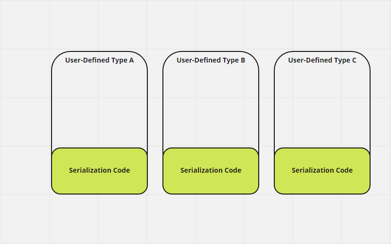
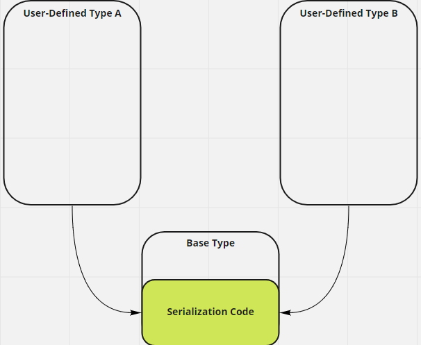

# Background

<style>
.child{
    width:  60%;
}

@media screen and (max-width: 600px) {
  .child{
      width:  100%;
  }
}

.desktop-70-mobile-100{
    width:  70%;
}

@media screen and (max-width: 600px) {
  .desktop-70-mobile-100{
      width:  100%;
  }
}

.desktop-50-mobile-100{
    width:  50%;
}

@media screen and (max-width: 600px) {
  .desktop-50-mobile-100{
      width:  100%;
  }
}
</style>

<script>
$( document ).ready(function() {
  var cw = $('.child').width();
  $('.child').css({
      'height': cw + 'px'
  });
});
</script>

## About the Author

Roland Shum: Engine Developer

I am a Computer Science students at the DigiPen Institute of Technology, and have been working on game projects together for several years.

[Here](https://store.steampowered.com/search/?developer=Handshake%20Firm) are some games I have worked on and published:


## Introduction

Arc Apellago was a year-long game project that I worked together with several members of the team. Its an action platformer with a focus on dash-attack and jumping around to get to the end of the level. We developed a C++ custom engine from scatch, integrating our own libraries and then using that engine to develop the game.

Parts of the engine I worked on:
- Integration of [Real Time Type Reflection (RTTR)](https://www.rttr.org/)
- **Integration of [JSON for Modern C++](https://github.com/nlohmann/json) serialization using RTTR**
- [ImGui](https://github.com/ocornut/imgui) Engine GUI generation using RTTR
- Designing archetypes for entities

Parts of the game I worked on:
- Visual effects
- Post processing effects
- Player feedback

And things outside of the engine such as:
- Configuring a student Azure VM to build our game on every push
  - CI / CD
- Configuring a student Amazon Web Service (AWS) VM to automatically sync the school's git repo to our internal private git server
- Tracked and scoped technical tasks as part of co-producer work and making sure everyone's workflow was smooth

This blog will focus on using **reflection for json serialization**. While I used RTTR as a reflection library, I believe the high level concept covers other reflection libraries. During the course of my work, I realized that there aren't many resources on this topic. I will be describing a simplified version of what I did and omitting long talks into the many mistakes I've made; I'll only point out my mistakes from time to time. **I hope this will be useful for people trying to thread on the same path I did.** 
## What are you talking about?

So essentially what I did was

1) Integrate reflection library (RTTR)
2) Integrate JSON reading and writing data
3) **For serialization**
   - **Use reflection to generate the JSON object**
   - **Use JSON object and JSON library to write to file**
4) For deserialization
   - Read JSON from file to read JSON object
   - Use JSON object to read achetypes
5) Use reflection data to generate editor GUIs for modifying values at runtime
   
This blog will be focused on json serialization with reflection.

### What is reflection
Reflection is the ability to inspect, modify, and call methods at runtime. Imagine being able to inspect your type of object, and getting information about it.


Essentially, you can get a MyStructType that describes "Hey I have a string name, an int data, a float bigNumber, and two methods. My name is 'MyStruct'".

### Why did you need reflection?

During the course of my research on serialization, I realized that there are only two ways to implement the system such that it was extendable and scalable.

**1) All serializable types inherit from a common base class ISerializable**
| Pros                                      | Cons                                                      |
|-------------------------------------------|-----------------------------------------------------------|
| Easy to understand (part of the language) | Cache miss on virtual functions (irrelevant on hindsight) |
| Easy to implement                         | **Each class needs to define how it serializes**              |

**2) Serialize through a generic reflection system**
| Pros                                                           | Cons                                        |
|----------------------------------------------------------------|---------------------------------------------|
| **Write once**! (Programmers don't need to write serializing code) | Not a simple concept to grasp for beginners |
|                                                                | Teammates won't understand until its done   |

The biggest factor here is **time saved**. If I can save time for other programmers, that is a huge win in my book. Let me dive into why the Inheritance route would, in fact, *add time* and how reflection *saves time*.

#### Serialization through inheritance
The idea is simple, inherit from a base type ISerializable that has a abstract virtual function serialize and deserialize. Now we have a common interface and type (ISerializable) to serialize. Unfortunately, every time we define a new class that inherits from ISerializable we would have to write the serializing code for that class.

```c++
class ISerializable{
    public:
    virtual JSON MemToJSON() const = 0; // Serialize
    virtual void JSONToMem(JSON) const = 0; // Deserialize
}

class Player : public ISerializable
{
    JSON MemToJSON() const override
    {
        // Something here
    }
    void JSONToMem(JSON) const override
    {
        // Something here
    }
}
class Item: public ISerializable
{
    JSON MemToJSON() const override
    {
        // Something here
    }
    void JSONToMem(JSON) const override
    {
        // Something here
    }
}
```
So what we end up with is something like this image where the programmer has handle serialization **for any custom type that they want serialized.**



This is clearly not the goal! So I took a second look. What if the base type can handle serialization of the child classes? Is it possible to implement something that looks like the below in C++?



Unfortunately, the base class **has** to know about the child class in order to serialize it. In C++, this can only be achieved via the [Curiously Recurring Template Pattern (CRTP) ](https://en.wikipedia.org/wiki/Curiously_recurring_template_pattern#:~:text=The%20curiously%20recurring%20template%20pattern,form%20of%20F%2Dbounded%20quantification.). Sprinkle in some [Substitution Failure Is Not An Error (SFINAE)](https://en.cppreference.com/w/cpp/language/sfinae) to identify properties, and you'll get a templated compile-time reflection system.

And so at the end of the day, the only way a generic serializer can only be written through a reflection system, whether its compile time introspection or run time reflection. 

Note: I've been mixing the terms introspection and reflection, but for serialization purposes they mean the same thing.

#### Why RTTR?
So I knew I wanted a reflection system, I had the choice of either writing one or taking a known solution. After doing a bit of research, I decided to use RTTR because of the following

1) Proven library means less chance of things blowing up
2) I wrote a [quick reflection system using clang](https://www.youtube.com/watch?v=DUiUBt-fqEY), but we were compiling in MSVC
3) I couldn't figure out a good way to handle pointers, references, and wrapped types
4) Using a proven library means getting feature out the door quicker   

And so I decided to use RTTR based on these four decisions.

Unfortunately, there is no third party solution that merges both RTTR and Json for Modern C++ libraries together. I had the choice of writing a reflection system, but I chose to use these third party libraries because I wanted to start the game iteration process as fast as possible.

```json
{
  "MyStruct" : {
	"name" : "Instance Name",
	"data" : 2,
	"bigNumber" : 2.0
  }
}
```


# Goals and Constraints
For the serializer to function, I constructed the system with several things in mind.
- Entity archetype saving and loading to Json
- Abstracted from gameplay programmers
  - Scripts don't have to care about serializing
- Json file is readable to humans
  - Designer can modify from json file


> Learning point:
The above seems good right? This was actually a **bad** set of goals. One major thing I overlooked was **saving and loading from a scene**. I also screwed up thinking that the **designer modifying from the json file** is a good thing. You want a tool for that instead.

# Implementation

I started working on the json integration first as I wanted to fullfill the Course's requirement on serialization first, and then do the reflection and GUI as an add on.

> Learning point: In hindsight, while in the short term this was the right decision,the long term was a bad one. Anyone can see once laid out that I should have worked with RTTR first, and then wrote the serializer and gui generator with it as a dependancy. Because of this mistake, I was straddled with legacy code that I had to write around.

## Serializer 1.0
The following is the diagram describing the serializer.


At 1.0, the goal was to get serialization working ASAP and getting past the grading requirments for it. I used the simplest method I know.

```c++
// Sample object
struct Vector3{
    float x, y, z;
    static JSON Serialize(const Vector3& vec) const
    {
        JSON j;
        j["x"] = vec.x;
        j["y"] = vec.y;
        j["z"] = vec.z;
        return j;
    }
    static Vector3 Deserialize(JSON& json)
    {
        Vector3 vec;
        vec.x = json["x"];
        vec.y = json["y"];
        vec.z = json["z"];
        return vec;
    }
}

class Serializer{
    public:
    template<typename T>
    JSON SerializeToJSON(const T& obj)
    {
        return T::Serialize(obj);
    }
    template<typename T>
    T DeserializeFromJSON(JSON& json)
    {
        return T::Deserialize(json);
    }
}

// somewhere in code
Vector3 dir = {0,0,0};
JSON j = Serializer::SerializeToJSON(dir);
save_to_file(j, "dir.json")
```
There were mainly two ways I saw to go with this

1) Use a template like what I am doing and call Serialize(). If T doesn't have this method compilation will fail.
2) All types inherit ISerializble, and then use polymorphism.

I went with option 1) because we were using glm::vec3 types and did not want to write an abstraction layer over them. Virtual functions also cause a cache miss, so I didn't want to lose out on performance.

>Learning Point: The cache miss point was totally irrelevant. It would never have mattered since the perf I saved was so small. Furthermore, a bunch of these small code and legacy Json files became a massive headache later on development when I refused to just delete them. I should have called a team meeting and insist on removing the legacy code and data instead of putting two different architechture types together

>Pondering Point: Should I have written an abstraction over glm (math library)? Common practice lean towards writing abstractions over every library you import, but a lot of glm functions only work because they expect glm types. Writing our own abstraction just meant writing boilerplate code over the glm ones, and that seemed like a waste of time since we don't plan on using another math library.

## Serializer 2.0

You may notice that the serializer 1.0 *does nothing*. It only gives ensures common interface of T (to have a method called Serialize()).
**Currently the object is responsibly for *how* it serializes itself, what we want is for the *serializer* to be responsible for that.** If we had 100 objects, that means we would have to write the specific serialization code for 100+ objects. But with one generic serializer we would theoretically save up to 1/3 of the time writing serialization.

What we currently have:


But what we really want is:


I'll now walk through a simplified version of my Serializer 2.0 and explain the thought process behind it. 

There are 3 main ideas crucial to bringing the initial algorithm together.
1) Deconstructing a user-defined data type
2) Understanding how things should be on the JSON side
3) Dealing with pointers, data structures, and containers

And after that I had to modify the algorithm to work with RTTR library. Lets drive right in.

### Deconstructing a user-defined data type
Every type in C++ can be deconstructed to its fundamental types of int, char, pointer, etc.

```c++
struct InnerClass
{
    int data;
    float floatdata;
}

struct OuterClass
{
    InnerClass innerClass;
    const char * c_string;
}
////////////////////////////////////
// Outerclass can be deconstructed into
OuterClass
{
    int data;
    float floatdata;
    const char* c_string;
}
```

So the plan is to deconstruct a type *as much as possible*. Hence the general algorithm I used is

```py
# version 1
def Serialize(obj):
    if obj is a basic type
        serialize data as one of the basic types
    else
        for each property on obj:
            Serialize(property)
```

Seems simple for now! Notice that I passed over what it means to be a basic type. While we understand in C++ those data types, what are the fundamental basic types in JSON? 

### Examining the JSON side
Json has five data types

1) Number
   - No distinction between floats and ints and unsigned etc
2) String
3) Boolean
4) Array
5) Object
   - Collection of name-value pairs
6) null
   - empty

Given these data types, it makes sense to store C++ user defined types as objects, and they would in turn recursively store things until its either 

1. A number
2. A string
3. A boolean
4. Or an array

I used the property name as the key, and the object itself as the value. This seemed most intuitive. You might notice that 'A number' doesn't describe the wide range of data types that can represent a number in C++. Thankfully, most JSON libraries can handle this. Thus when serialized OuterClass would look like 

```json
{
    "OuterClass" : {
        "innerClass" : {
            "data" : 0,
            "floatdata": 0.0
        },
        "c_string" : "cstring"
    }
}
```


> Learning Point: One of the goals were to have the designer change the data from the json file. Thus I wanted the json file to be "human readable". This in turn led to some very poor choices like serializing Vec3 as an array of 3 floats etc. These edge cases piled up instantly and made my deseriailization work a mess. If I were to do this again I would just try to write the base code as intuitively (for a programmer) as possible, and then write a tool to modify the json file.

>Pondering Point: What if I wrote a tool that converted older version jsons to newer ones? Thinking back, this wasn't much of a choice since there are around 4 json files and its probably not worth it.

Take note that this was the *final* output that I have decided on. During the course of developement, there were three different outputs that I tried, and I finally settled on keeping the algorithm clean instead.

```py
# Version 2
# Kickoff function
def Serialize(obj, name):
    JSON jsonObj
    SerializeRecur(obj, jsonObj[name])
    return jsonObj

# Arg0: object we want to serialize
# Arg1: json object to add onto
def SerializeRecur(obj, jsonObj):
    if obj is a basic type
        SerializeBasicType(obj, jsonObj[obj.name()])
    else
        for each property on obj:
            SerializeRecur(property, jsonObj[property.name()])

// Possible usage
Outerclass outerClass
Serialize(outerClass, "OuterClass") 
```
>The mentioned three different versions of output became a long lasting pain. I could never easily refactor my code without totally busting the previous versions. In hindsight, I should have gotten rid of them ASAP and swapped to the newer versions. Also, I should have given my Json files a version number to keep track of which version of the loader I was using. That way I could have kept my code clean instead of integrating them all into Frankenstien. 

### Dealing with C++'ness' issues
I've explained the very high level general algorithm of deconstructing a C++ type into its base type, and how I translated that into JSON file. When it comes to the dirt though, there are lots of weird C++ issues to deal with, and I'm glad I used RTTR as a library instead of writing my own reflection system to deal with them.

This part really consists of deconstructing what it means to be a *fundamental type in the context of serialization*. 

#### Dealing with polymorphism
Heres an example of some very reasonable code that would break our current algorithm.

```c++
struct Base { RTTR_ENABLE() };
struct Middle : Base { RTTR_ENABLE(Base) };
struct Derived : Middle { RTTR_ENABLE(Middle) };

struct Foo { Base* bar = nullptr;};

Foo foo;
Derived derived;

foo.bar = &derived;
// How do we serialize Derived when we have a pointer to Bar?
```
Polymorphism! And pointers! Pointers are a base data type, how do we deal with it? On the topic of pointers, what if it was a *shared* pointer? 

```c++
struct Foo {std::shared_ptr<Derived> ptr;}

Foo foo;
std::shared_ptr<Derived> instance = std::make_shared<Derived>();
foo.ptr = instance;
// How do we deal with this??
```
> At the start of the project, we were avoiding shared pointers because we were not doing multithreading and did not think we would need to manage our objects. This turns out to be completely false assumption when we realized our game code had behavior that references other behaviors. This caching became a classic dangling pointer problem. We only noticed this problem a quater of the way in the project, and decided to convert to smart pointers rather then deal with implementing some wrapper that acheived the same thing but specific to our engine. There was also a discussion about getting all the references every frame, but that was thrown out once we realized some behaviors *needed* references, like AIs need to know player and the search isn't cheap.

So lets revisit our high level algorithm, and modify it. We need to deal with getting, as RTTR defines it, the *raw type* of our object. A raw type is a type *without any qualifiers* (const, volatile, etc) nor any pointer.
After that, we need to detect if it is a shared_ptr, or something that wraps a value. Luckily, RTTR provides [functionality](https://www.rttr.org/doc/master/classrttr_1_1type.html#ad17345a59c8e3cc8a754eb4ec124581e) that detects if a type is a wrapper type. 

As for getting the derived type of a pointer, RTTR deals with that for us with [get_derived_type()](https://www.rttr.org/doc/master/classrttr_1_1instance.html#ab30381b954f8d8abc2da9c5162fb130d).

I'll also swap the pseudocode for checking base type for an rttr function [is_class()](https://www.rttr.org/doc/master/classrttr_1_1type.html#a8bd100682c9b846f6da1c5c9fb96f8c6).

```py
# Version 3
# Here I'm working in psuedo code with RTTR API

# Kickstart function
def Serialize(obj, name):
    JSON jsonObj
    SerializeRecur(obj, jsonObj[name])
    return jsonObj

# Arg0: object we want to serialize
# Arg1: json object to add onto
def SerializeRecur(obj, jsonObj):
    # If object is a fundemental C++ type, we'll go straight to writing it
    if not obj.is_class()
        SerializeBasic(obj, jsonObj)

    else
        # Get the type of the object if it is a wrapper
        if obj.type.get_raw_type().is_wrapper()
            localObj = obj.get_wrapped_instance()
        else
            localObj = obj

        # Deal with polymorphism issues by going to the derived class
        derivedType = localObj.get_derived_type()
        # Get property list from the derived type
        var property_list = derivedType.get_properties()

        # Iterate through the property list
        for var property in property_list
            # Get the value of the property
            rttr::variant property_value = property.get_value(localObj)
            # Keep serializing them based on property name
            SerializeRecur(property_value, jsonObj[property.name()])


// Possible usage
Outerclass outerClass
Serialize(outerClass, "OuterClass") 
```

### Dealing with arrays and data structures
Some very useful data structures that we want to serialize are arrays, vectors, and C++ maps (ordered or unordered). Thankfully they have pretty 1 : 1 conversions to JSON data.
- C++ Arrays <-> JSON Arrays
- C++ Vectors <-> JSON Arrays
- C++ Maps <-> JSON Objects

Even better, RTTR has two methods of identifying containers that cover your STL data containers. [is_associative_container()](https://www.rttr.org/doc/master/classrttr_1_1variant.html#aabe380968e1d9fcd27a2f3e77728b197) and [is_sequential_container()](https://www.rttr.org/doc/master/classrttr_1_1variant.html#a2d584cf950f15d1a52469b5f042488a3). [Associative containers](https://en.wikipedia.org/wiki/Associative_containers) are like maps, you map one thing to another. [Sequential containers](https://en.wikipedia.org/wiki/Sequence_container_(C%2B%2B)) are containers with memories laid out contigiously, like vectors and arrays. According to wikipedia, the current C++ data structures are below.
- Sequential Container
  - Array
  - Vector
  - List
  - Forward_list
  - Deque
- Associative Container
  - Set
  - Map
  - Multiset
  - Multismap
  
And so we will have


- C++ Array <-> Sequential Container <-> JSON Array
- C++ Vector <-> Sequential Container <-> JSON Array
- C++ Maps <-> Associative Container <-> JSON Objects
- C++ Hash Maps (Unordered_*) <-> Associative Container <-> JSON Objects

Which simplifies to
- Sequential Container <-> JSON Array
- Associative Container <-> JSON Objects

So we will identify if the type of the object is sequential or associative, and if they are we will handle them.
```py
# Version 4
# Here I'm working in psuedo code with RTTR API

# Kickstart function
def Serialize(obj, name):
    JSON jsonObj
    Serialize(obj, jsonObj[name])
    return jsonObj

# Arg0: object we want to serialize
# Arg1: json object to add onto
def SerializeRecur(obj, jsonObj):
    # If object is a fundemental C++ type, we'll go straight to writing it
    if not obj.is_class()
        SerializeBasic(obj, jsonObj)
    else if obj.is_associative_container()
        WriteArray(obj, jsonObj)
    else if obj.is_sequential_container()
        WriteAssociative(obj, jsonObj)
    else
        # Get the type of the object if it is a wrapper
        if obj.type.get_raw_type().is_wrapper()
            localObj = obj.get_wrapped_instance()
        else
            localObj = obj

        # Deal with pointer issues by going to the derived class
        derivedType = localObj.get_derived_type()
        # Get property list from the derived type
        var property_list = derivedType.get_properties()

        # Iterate through the property list
        for var property in property_list
            # Get the value of the property
            rttr::variant property_value = property.get_value(localObj)
            # Keep serializing them based on property name
            SerializeRecur(property_value, jsonObj[property.name()])


// Possible usage
Outerclass outerClass
Serialize(outerClass, "OuterClass") 
```
#### Sequential Container Seriailization 
After detecting whether it is an associative or a sequential container, we have to decide how to serialize it. We'll start with sequential since thats the simplest. Since sequential maps to Json arrays 1 to 1, this was pretty simple.

```py
def WriteArray(obj, jsonObj):
    jsonObj.WriteJsonArray()

    for each item in obj, and counter start from 0:
        WriteVariant(item, writer[counter])
        counter += 1
```

```json
{
    "array" : [
        a,
        b,
        c
    ],
}
```
#### Associative Container
This one is a *bit* more complicated. We want to store both key and value, and we know our object will have multiple key and value. So lets use a json array to indicate all the key-pair values as json objects. 

```py
def WriteAssociative(obj, jsonObj):
    jsonObj.WriteJsonArray()

    for each item in obj, and counter start from 0:
        WriteVariant(item.first, writer[i]["Key"])
        WriteVariant(item.second, writer[i]["Value"])
```
and we're expecting something like this.
```json
    "dictionary" : [
        {
            "key": "red",
            "value": {
                "x": 5,
                "y": 6
            }
        },
        {
            "key": "green",
            "value": {
                "x": 1,
                "y": 2
            }
        },
    ]
```


### Wrangling RTTR
It was hard working with a library where I had no idea how it internally works. Let me explain some of the main concepts of RTTR that I had trouble understanding at first. This section will detail mainly how I coded the above psuedocodes in a C++ manner.

- [Instance](https://www.rttr.org/doc/master/classrttr_1_1instance.html)
  - Holds a reference to the given object.
  - Think of it as a std::any<T&>
- [Variant](https://www.rttr.org/doc/master/register_variant_page.html)
  - Return value for properties and methods
  - Content is ***copied*** over to new instance of content
  - Think of it as a std::any<T>
- [Properties](https://www.rttr.org/doc/master/register_properties_page.html)
  - Pretty straight forward
- [Policies](https://www.rttr.org/doc/master/register_policies_page.html)
  - Control how RTTR creates your object
  - This matters when the code starts running too slow
  
> One of the weirder things about the RTTR library is how *different* and how *little* an instance provides over a variant. I would expect an instance to have just as much to offer as a variant in terms of interface. It seems strange that I would need to copy an object anytime I wanted to query more information on it.

> Also this sets a constraint that you need to use assignment operators for whatever you're serializing. And default constructors for compatibility with sequential and associative containers.

With those in mind, lets get to writing actual C++ code and we'll start with registering our class with RTTR
#### Registration
This part is pretty straightforward, do it in the CPP with a couple of macros from RTTR. Here, we register InnerClass with properties innerClass and c_string. After that we register InnerClass with data and floatdata.
```c++
RTTR_REGISTRATION
{
	using namespace rttr;
	registration::class_<InnerClass>("InnerClass")
		.constructor<>()
		(
			rttr::policy::ctor::as_raw_ptr // Construct as raw pointer instead of shared for simplicity's sake
		)
		.property("data", &InnerClass::data)
		.property("floatdata", &InnerClass::floatdata)
	;

    registration::class_<OuterClass>("OuterClass")
		.constructor<>()
		(
			rttr::policy::ctor::as_raw_ptr // Construct as raw pointer instead of shared for simplicity's sake
		)
		.property("innerClass", &OuterClass::innerClass)
		.property("c_string", &OuterClass::c_string)
	;
}

```
#### Writing the serialization code
Lets begin by taking in a name and a instance (reference) of the object.

```c++
// Kickstart function
JSON ToJson(rttr::instance obj, const std::string& name)
{
    JSON writer;
    ToJSonRecur(obj, writer[name]);
    return writer;
}
```

##### Improvements to fundemental type detection
I was stuck here for a long time figuring out how wrangle the conversions between instances and variants and serialization. In the end, I implemented a function dedicated to writing variants, and then another function for writing basic types. Both of these work with a "white list"; that is if the function detects it cannot be serialized and return false.


Lets take a look at the recursive function from before.
```c++
// !Passing something that isn't supposed to be written as a Json Object will have issues
void ToJsonRecur(rttr::instance obj, JSON& writer)
{
    // If we successfully serialized, it means its a fundamental type
    if(WriteFundamentalType(obj, writer))
        return;
    rttr::instance localObj;
    // Get the type of the object if it is a wrapper
    if(obj.get_type().get_raw_type().is_wrapper())
        localObj = obj.get_wrapped_instance();
    else
        localObj = obj;

    // Get the property list while dealing with polymorphism derived type
    auto prop_list = obj.get_derived_type().get_properties();
    
    // Iterate through the property list
    for (auto prop : prop_list)
    {
        // Get the value of the property
        rttr::variant prop_value = prop.get_value(obj);
        if (!prop_value)
            continue; // cannot serialize, because we cannot retrieve the value
        // Get the name of the property
        const auto name = prop.get_name();
        // Attempt to write the variant
        if (!VariantSerializer(prop_value, writer[name.data()]))
        {
            std::cerr << "cannot serialize property: " << name << std::endl;
        }
    }
}

// Example use case
OuterClass foo;
JSON writer;
ToJsonRecur(foo, "foo", writer);
```
The biggest difference is the use of rttr::instance as the object. This was chosen for the simple interface given. For some weird reason I **could not** convert an instance to a variant. It might make more sense to pass in a variant in that sense since variants have more functionality, but its also a copy which can be expensive. 

This choice removed the possibility of checking whether the instance is a fundamental type, and all the checking for the the maps before we split it up. This actually helped writing the code in a certain way because I could seperate the code more clearly from an RTTR perspective.

A second issue that came up was how to abstract the fundamental type seriailization detection out. In the end, I opted for a function that will attempt to serialize the object as a fundamental type, and if it fails it will return false. We will then test if it is any of the data containers, and then check how many properties the object has. If there it has  properties, then we can serialize it as a jsonObj.

So the plan is to deal with each RTTR abstraction at each level appropriately.


And a fleshed out detail of the plan is on this image.   


With the new algorithm, WriteVariant() is the crux of it all. It attempts to write the object, and if it can't have several fallbacks, and at the end of it will either return true or fail. Failing means a case we haven't dealt with yet(pointers for example).

Another side-effect of this version of the algorithm is that we can only kick off the serialization function if the object we're passing in has properties. Meaning the type has to be a jsonObj. However, we can easily use WriteVariant() as the entry point if required.

> Learning Point: Typically, serialization code is paired with deserialization code. Hence the simpler your serialization code, the easier it will be to write your deserialization. For my engine code, I did my own serialization of many glm types, like glm::vec3, early on and this came back to haunt me as I had to keep creating edge cases for detecting a glm::vec3 in my deserialization code. Keep it simple, less things to worry about when writing deserialization.

#### C++ code
Headed back to the code, lets show the changed toJsonRecur().

```c++
void toJsonRecursive(const instance& obj, json& writer)
{
    // Dealing with wrapped objects
    instance localObj;
    if(obj.get_type().get_raw_type().is_wrapper())
        localObj = obj.get_wrapped_instance()
    else
        localObj = obj;
    // Handling pointer polymorphism cases
    auto prop_list = obj2.get_derived_type().get_properties();
    for (auto prop : prop_list)
    {
        // Retrieving value from property
        variant prop_value = prop.get_value(obj2);
        if (!prop_value)
            continue; // cannot serialize, because we cannot retrieve the value
        // Retrieve name of property
        const auto name = prop.get_name();
        // Serialize value of property using name
        if (!WriteVariant(prop_value, writer[name.data()]))
        {
            std::cerr << "Failed to serialize" << name << std::endl;
        }
    }
}
```

Pretty much the same thing as the initial algorithm, except without all the checking. The checking has now moved to WriteVariant(), and here is the crux of the algorithm.

```c++
bool WriteVariant(const variant& var, json& writer)
{
    // Deal with wrapped type
    variant localVar = var;
    type varType = var.get_type();
    if(varType.is_wrapper())
    {
        varType = varType.get_wrapped_type();
        localVar = localVar.extract_wrapped_value();
    }

    if (AttemptWriteFundementalType(varType, localVar, writer))
    {
        // Successful write!
    }
    // If its not a fundamental, is it a sequential?
    else if (var.is_sequential_container())
    {
        WriteArray(var.create_sequential_view(), writer);
    }
    // Is it associative
    else if (var.is_associative_container())
    {
        WriteAssociativeContainer(var.create_associative_view(), writer);
    }
    else
    {
        // Not a fundemental, or a container. Check if its an object
        auto child_props = varType.get_properties();
        if (!child_props.empty())
        {
            // We have properties, thus we can be serialized as an object
            toJsonRecursive(var, writer);
        }
        else
        {
            // Assert
            // Some unknown type that is not a fundamental, has no properties, and is not a data structure
            // Probably some registration issue
            // Or its a pointer! I handled pointers in here my game code
            assert("Unknown RTTR serilization edge case that we haven't discovered");
            return false;
        }
    }

    return true;
}
```
I moved the data container checking and writing of fundamental types here. Pretty self-explanatory stuff here. The only thing really worth mentioning is that I had to create a *_container view to view the container for WriteArray() and WriteAssociativeContainer().

Now lets take a look at the writing of fundamental types. One benefit here is that if we have more fundamental types to handle we can just put it in this function.

```c++
bool AttemptWriteFundementalType(const type& t, const variant& var, json& writer)
{
    // Json Number
    if (t.is_arithmetic())
    {
        if (t == type::get<bool>())
            writer = var.to_bool();
        else if (t == type::get<char>())
            writer = var.to_bool();
        else if (t == type::get<int>())
            writer = var.to_int();
        else if (t == type::get<uint64_t>())
            writer = var.to_uint64();
        else if (t == type::get<float>())
            writer = var.to_double();
        else if (t == type::get<double>())
            writer = var.to_double();
        return true;
    }
    // Enumeration as string
    else if (t.is_enumeration())
    {
        bool ok = false;
        // Attempt to serialize as string
        auto result = var.to_string(&ok);
        if (ok)
        {
            writer = var.to_string();
        }
        else
        {
            // Attempt to serialize as number
            auto value = var.to_uint64(&ok);
            if (ok)
                writer = uint64_t(value);
            else
                writer = nullptr;
        }

        return true;
    }
    // Strings!
    else if (t == type::get<std::string>())
    {
        writer = var.to_string();
        return true;
    }

    // Not a fundamental type we know how to process
    return false;
}
```
Notice that this function doesn't expect itself to handle all sorts of weird stuff like pointers, wrappers, or anything like that. Its very much a **"If you have these I will serialize it. If not then good bye."**

As for the associative and sequential containers:
```c++
static void WriteArray(const variant_sequential_view& view, json& writer)
{
    // Init array
    writer = json::array();
    int i = 0;
    for (const auto& item : view)
    {
        WriteVariant(item, writer[i]);
        i++;
    }
}

static void WriteAssociativeContainer(const variant_associative_view& view, json& writer)
{
    static const string_view key_name("key");
    static const string_view value_name("value");

    writer = json::array();
    int i = 0;
    // Dealing with keys = values containers like sets
    if (view.is_key_only_type())
    {
        for (auto& item : view)
        {
            WriteVariant(item.first, writer[i]);
            i++;
        }
    }
    else
    {
        for (auto& item : view)
        {
            WriteVariant(item.first, writer[i][key_name.data()]);
            WriteVariant(item.second, writer[i][value_name.data()]);
            i++;
        }
    }
}
```

# Conclusion
You usually have to pair a serialization function with a deserialization function, but with this the base is setup such that it'll be easier to do deserialization. If I have time, I'll talk about how to deserialize from the json file to memory; its not particularly hard now that we have a good base setup.

A couple of things to note: this sample code doesn't handle pointers or void pointers. Moreover, its not exactly efficient since we are calling a ton of copy constructors and assignment constructors. However, it does acheieve the goal of moving the burden of writing serialization to a unified system.

I hope this description will help someone in the future doing something similar and avoid the pains I had to trod through. Please don't try to specialize the serializer to do anything 'specific', you will have pains writing the deserializer. Just write a tool to modify the json instead.


With that this is the end of this small write up. I did not come up with the entire thing myself; I had to do quite a lot of research and looking up and seeing other people's code before coming to this solution. RTTR has its own example of how to do json serialization, and it was from their code that I solved the issues with instances and variants. 

[Here is the Github link](https://github.com/ShumWengSang/Reflection-Json-Serializer)  to the source code used for examples here.